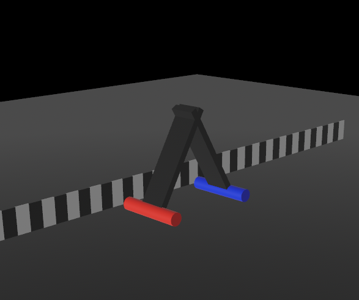

#Caterpillar
Actually not a whole caterpillar but one part of it 

Meet this piece of caterpillar  

Red part - part with hight friction coefficient
Blue one - with low 

The movement occurs due to the switching of friction at the ends and the change in the maximum bending angle of the joint.
